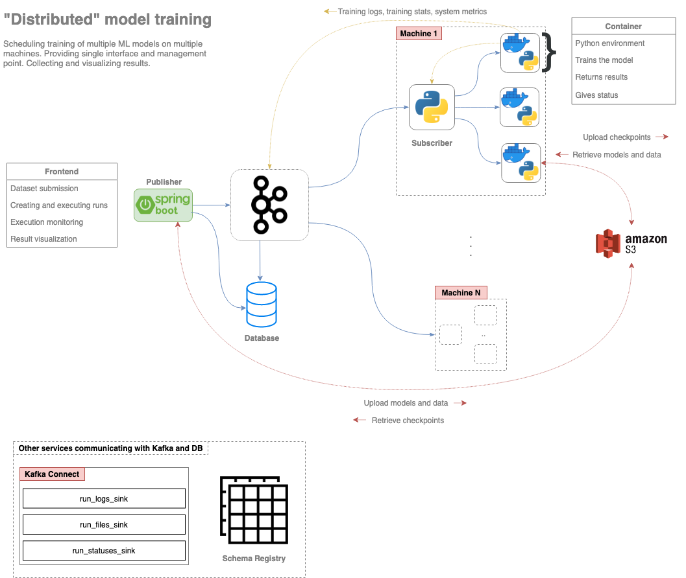

* Microservice implementation of this application can be found in https://github.com/filipovskid/drboson-ddd-combined

# DRBoson - The R Boson

Application for scheduling executinon of Machine Learning (ML) model training processes across different machines. Training of a single model is done on a single machine, thus, a single process has access only to resources from a single machine.

Overview of the DRBoson architecture. This figure is similar to the microservice implementation of DRBoson, however, it is implemented as a monolith and does not interract with supplied datasets.

  

